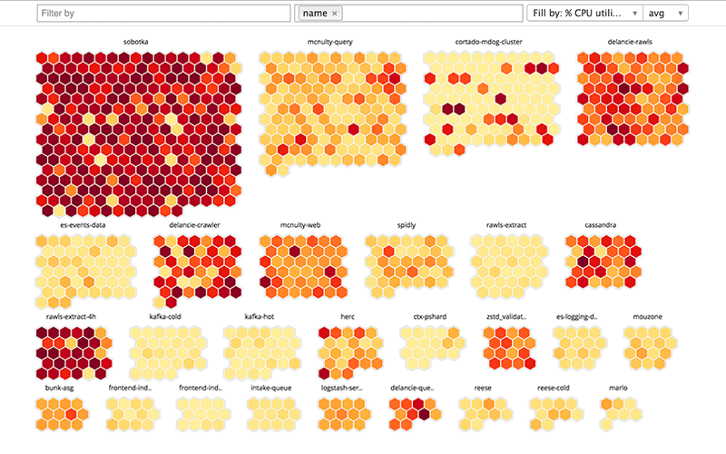

# Software Engineer Homework

1. [Homework Assignment](#homework-assignment)
   1. [Tasks](#tasks)
      1. [Frontend](#frontend)
      1. [Backend / full-stack](#backend--full-stack)
   1. [Notes](#notes)
1. [Get started](#get-started)
   1. [(N)ode (V)ersion (M)anager](#node-version-manager)
   1. [Yarn](#yarn)
1. [Start Projects](#start-projects)

   1. [Yarn workspace](#yarn-workspace)
   1. [Good to know](#good-to-know)
      1. [Server -package](#server--package)
      1. [UI -package](#ui--package)

## Homework Assignment

At Hoxhunt we deal with large sets of data. In this exercise you will enhance and implement a heat map visualization of user risk. You'll have a data set containing a list of users with a `failureRate` ranging from 0.0 to 1.0 and `department` parameter (e.g. "sales") which can be used to split the users in to groups.

Your task is to process the data and modify the visualization so our customers can have a nice per department view of their weak points. Here is an example from another problem domain:



You can use this idea or change the approach for the visualization all together!

### Tasks:

You're provided with a simple application consisting of a backend and frontend. The [Get Started](#get-started) contains points on getting it running.

Below are a few things that could use some work on the application. Feel free to improve on any other aspects you find in need of some tuning.

We're interested in seeing how you approach and solve a particular problem and discussing your reasons for tacking any other shortcomings you worthy of spending your time on.

#### Frontend

1. Current visualization is borderline useless. It could be more useful if the data was rendered per department.
1. The frontend seems a tad fragile. It looks like rendering breaks if the amount of input data changes. This could use a little work.
1. Layout is odd

#### Backend

The GraphQL schema is very simple:

```graphql
type Department {
  id: ID!
  name: String!
}

type User {
  id: ID!
  risk: Float
  departmentId: Int!
  department: Department!
}

type Query {
  users: [User!]!
}
```

1. Query performance is not ideal.
1. The current schema is probably not optimal for the UI in its intended form. It could use a little adjustment.

### Notes

Return the exercize as a git repository. If you want to return it as a private repository, remember to share access with us. More info should be included in intro email.

Try to keep the following things in mind

- Your code should fit the coding style of the base project
- If something is not done well in the base project feel free to improve on it
- Pay attention to your commits and keep the messages clean and concise

## Get started

To install or activate required dependencies, run following commands

You will need to install [nvm](https://github.com/nvm-sh/nvm#installing-and-updating) and [yarn](https://classic.yarnpkg.com/lang/en/docs/install)

### (N)ode (V)ersion (M)anager

`nvm install && nvm use`

### Yarn

`yarn`

## Start Projects

Server:
`yarn workspace server start`

UI:
`yarn workspace ui start`

### Yarn workspace

This project uses yarn 2's workspace to ease out usage of monorepo structure

https://en.wikipedia.org/wiki/Monorepo

CLI usage (e.g. how to run commands from root to specific projects)

https://yarnpkg.com/cli/workspace

### Good to know

You are provided with a project base, which contains two packages - `ui` and `server`.

Server package is using sqlite. This is purely for convenience of this assignment. It's usually not a recommended approach for web applications.

#### Server -package

- Relevant used dependencies: typescript, express, express-graphql, sqlite3

#### UI -package

- Relevant used dependencies: typescript, react, styled-components and urql (graphql library)
- Development and build environment: vite
